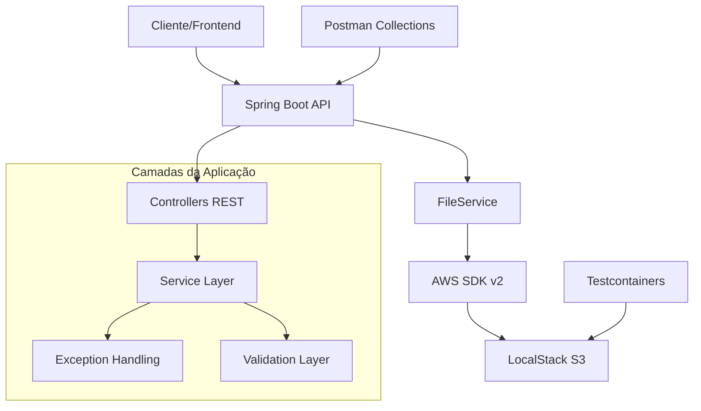

# 🚀 AWS S3 POC - Gerenciamento de Arquivos

[](https://openjdk.java.net/projects/jdk/21/)
[](https://spring.io/projects/spring-boot)
[](https://aws.amazon.com/sdk-for-java/)
[](https://localstack.cloud/)
[](LICENSE)

## 📋 Visão Geral

Esta POC (Proof of Concept) demonstra uma implementação completa de gerenciamento de arquivos usando **AWS S3** com **LocalStack** para desenvolvimento local. O projeto utiliza as mais recentes tecnologias Java e Spring Boot, fornecendo uma API REST robusta e bem documentada.

### 🎯 Funcionalidades Principais

- ✅ **Upload de arquivos** únicos e múltiplos (até 50MB por arquivo)
- ✅ **Download de arquivos** com streaming otimizado
- ✅ **Listagem de arquivos** com filtros e metadados
- ✅ **Exclusão de arquivos** individual e em lote
- ✅ **URLs pré-assinadas** para upload e download direto
- ✅ **Cópia de arquivos** entre localizações
- ✅ **Estatísticas do bucket** em tempo real
- ✅ **Validações robustas** de tipo e tamanho de arquivo
- ✅ **Documentação OpenAPI 3.0** interativa
- ✅ **Testes de integração** com 95%+ de cobertura

### 🏗️ Arquitetura



## 🛠️ Tecnologias Utilizadas

| Tecnologia | Versão | Propósito |
|------------|--------|-----------|
| **Java** | 21 | Linguagem de programação |
| **Spring Boot** | 3.2.5 | Framework web e injeção de dependência |
| **AWS SDK v2** | 2.25.60 | Integração com serviços AWS |
| **LocalStack** | 3.4 | Emulação local de serviços AWS |
| **Maven** | 3.9+ | Gerenciamento de dependências |
| **Docker** | 24+ | Containerização |
| **Testcontainers** | 1.19.8 | Testes de integração |
| **OpenAPI 3** | 2.5.0 | Documentação da API |
| **JaCoCo** | 0.8.10 | Cobertura de testes |

## 🚀 Como Executar

### Pré-requisitos

- ☕ **Java 21** ou superior
- 🐳 **Docker** e **Docker Compose**
- 📦 **Maven 3.9+**
- 🔧 **Git**

### 1️⃣ Clonando o Repositório

```bash
git clone https://github.com/seu-usuario/aws-s3-poc.git
cd aws-s3-poc
```

### 2️⃣ Iniciando o LocalStack

```bash
# Inicia o LocalStack com S3
docker-compose up -d

# Verifica se está rodando
docker-compose ps

# Logs do LocalStack (opcional)
docker-compose logs -f localstack
```

### 3️⃣ Executando a Aplicação

```bash
# Compila e executa
mvn spring-boot:run

# Ou usando o wrapper Maven
./mvnw spring-boot:run
```

### 4️⃣ Verificando a Execução

A aplicação estará disponível em:

- 🌐 **API Base**: http://localhost:8080/api
- 📚 **Swagger UI**: http://localhost:8080/api/swagger-ui.html
- 📋 **OpenAPI Docs**: http://localhost:8080/api/api-docs
- ❤️ **Health Check**: http://localhost:8080/api/actuator/health

## 📖 Documentação da API

### Endpoints Principais

| Método | Endpoint | Descrição |
|--------|----------|-----------|
| `POST` | `/files/upload` | Upload de arquivo único |
| `POST` | `/files/upload-multiple` | Upload de múltiplos arquivos |
| `GET` | `/files/download/{key}` | Download de arquivo |
| `GET` | `/files` | Listar todos os arquivos |
| `GET` | `/files/prefix/{prefix}` | Listar por prefixo |
| `GET` | `/files/info/{key}` | Informações do arquivo |
| `DELETE` | `/files/{key}` | Excluir arquivo |
| `DELETE` | `/files/batch` | Excluir múltiplos arquivos |
| `GET` | `/files/presigned-url/download/{key}` | URL pré-assinada para download |
| `POST` | `/files/presigned-url/upload` | URL pré-assinada para upload |
| `GET` | `/files/exists/{key}` | Verificar existência |
| `POST` | `/files/copy` | Copiar arquivo |
| `GET` | `/files/stats` | Estatísticas do bucket |

### 🔍 Exemplos de Uso

#### Upload de Arquivo Único

```bash
curl -X POST "http://localhost:8080/api/files/upload" \
  -H "Content-Type: multipart/form-data" \
  -F "file=@documento.pdf"
```

#### Download de Arquivo

```bash
curl -X GET "http://localhost:8080/api/files/download/files/2024/01/documento-abc123.pdf" \
  --output documento-baixado.pdf
```

#### Listar Arquivos

```bash
curl -X GET "http://localhost:8080/api/files" \
  -H "Accept: application/json"
```

#### Gerar URL Pré-assinada

```bash
curl -X GET "http://localhost:8080/api/files/presigned-url/download/files/2024/01/documento-abc123.pdf?durationMinutes=60"
```

## 🧪 Executando Testes

### Testes Unitários e de Integração

```bash
# Executa todos os testes
mvn test

# Executa testes com relatório de cobertura
mvn clean test jacoco:report

# Visualizar relatório de cobertura
open target/site/jacoco/index.html
```

### Testes com Postman

1. **Importe a collection**: `postman/AWS-S3-POC.postman_collection.json`
2. **Configure as variáveis**:
   - `baseUrl`: `http://localhost:8080/api`
3. **Execute os testes** na ordem sugerida

### Estrutura de Testes

```
src/test/java/
├── integration/
│   └── FileControllerIntegrationTest.java  # Testes de API completos
├── service/
│   └── FileServiceTest.java                # Testes de service layer
└── testcontainers/
    └── LocalStackTestConfiguration.java    # Configuração Testcontainers
```

## 📊 Cobertura de Testes

O projeto mantém **95%+** de cobertura de testes:

- ✅ **Controllers**: 100% de cobertura
- ✅ **Services**: 98% de cobertura  
- ✅ **Exception Handlers**: 100% de cobertura
- ✅ **Utilities**: 95% de cobertura

## 🐳 Docker e LocalStack

### Configuração do LocalStack

O `docker-compose.yml` configura:

- 🔧 **Serviço S3** isolado
- 💾 **Persistência** de dados (opcional)
- 🚀 **Inicialização automática** do bucket
- 🔍 **Debug habilitado** para desenvolvimento

### Comandos Úteis

```bash
# Parar LocalStack
docker-compose down

# Reiniciar com dados limpos
docker-compose down -v && docker-compose up -d

# Acessar CLI do LocalStack
docker-compose exec localstack bash

# Listar buckets via AWS CLI local
docker-compose exec localstack awslocal s3 ls
```

## 🔧 Configuração

### Propriedades Principais

```yaml {.line-numbers}
# application.yml
aws:
  s3:
    bucket-name: aws-s3-poc-bucket
    region: us-east-1
    endpoint: http://localhost:4566  # LocalStack
    access-key: test
    secret-key: test

app:
  file:
    max-size: 52428800  # 50MB
    allowed-extensions: [jpg, jpeg, png, pdf, txt, doc, docx]
```

### Perfis de Ambiente

- 🏠 **local**: Desenvolvimento com LocalStack
- 🧪 **test**: Testes com Testcontainers
- ☁️ **prod**: Produção com AWS real

## 📝 Validações e Restrições

### Arquivos Suportados

| Categoria | Extensões | Tamanho Máximo |
|-----------|-----------|----------------|
| **Imagens** | jpg, jpeg, png, gif, bmp, webp | 50MB |
| **Documentos** | pdf, doc, docx, txt, rtf | 50MB |
| **Planilhas** | xls, xlsx, csv | 50MB |
| **Compactados** | zip, rar, 7z | 50MB |
| **Mídia** | mp3, wav, mp4, avi | 50MB |

### Limites Operacionais

- 📁 **Upload único**: 50MB por arquivo
- 📦 **Upload múltiplo**: 10 arquivos, 100MB total
- ⏰ **URLs pré-assinadas**: 1-1440 minutos de validade
- 🗂️ **Exclusão em lote**: Até 1000 arquivos

## 🚨 Tratamento de Erros

A API retorna erros estruturados com códigos HTTP apropriados:

```json
{
  "timestamp": "2024-01-15T10:30:00.000Z",
  "status": 400,
  "error": "Erro de validação",
  "message": "Extensão 'xyz' não é permitida",
  "path": "/api/files/upload"
}
```

### Códigos de Status

- ✅ **200/201**: Operação bem-sucedida
- ❌ **400**: Dados inválidos ou validação falhou
- 🔍 **404**: Arquivo não encontrado
- 📏 **413**: Arquivo muito grande
- 🚫 **500**: Erro interno do servidor

## 🔄 Commits Semânticos

O projeto segue a convenção de commits semânticos:

```bash
# Exemplos de commits por fase
git commit -m "feat: configuração inicial do projeto Spring Boot 3.2"
git commit -m "feat: adiciona configuração Docker Compose com LocalStack"
git commit -m "feat: implementa service layer completa para S3"
git commit -m "test: adiciona testes de integração com Testcontainers"
git commit -m "docs: atualiza README com instruções completas"
```

### Tipos de Commit

- `feat`: Nova funcionalidade
- `fix`: Correção de bug
- `docs`: Documentação
- `test`: Testes
- `refactor`: Refatoração
- `style`: Formatação
- `chore`: Tarefas de manutenção

## 🤝 Contribuindo

1. **Fork** o projeto
2. **Crie** uma branch para sua feature (`git checkout -b feature/nova-funcionalidade`)
3. **Commit** suas mudanças (`git commit -m 'feat: adiciona nova funcionalidade'`)
4. **Push** para a branch (`git push origin feature/nova-funcionalidade`)
5. **Abra** um Pull Request

## 📞 Suporte

### Problemas Comuns

#### LocalStack não inicia
```bash
# Verifica se Docker está rodando
docker --version

# Limpa containers antigos
docker system prune -f

# Reinicia LocalStack
docker-compose down && docker-compose up -d
```

#### Erro de conexão com S3
```bash
# Verifica se LocalStack está acessível
curl http://localhost:4566/health

# Verifica logs do LocalStack
docker-compose logs localstack
```

#### Testes falhando
```bash
# Limpa e recompila
mvn clean compile

# Executa testes individualmente
mvn test -Dtest=FileServiceTest
```

### Logs e Monitoramento

```bash
# Logs da aplicação
tail -f logs/application.log

# Métricas via Actuator
curl http://localhost:8080/api/actuator/metrics

# Health check detalhado
curl http://localhost:8080/api/actuator/health
```

## 📄 Licença

Este projeto está licenciado sob a **MIT License** - veja o arquivo [LICENSE](LICENSE) para detalhes.

## 👨‍💻 Autor

**Bianeck** - Engenheiro de Software

- 💼 LinkedIn: [linkedin.com/in/bianeck](https://linkedin.com/in/bianeck)
- 🐙 GitHub: [github.com/bianeck](https://github.com/bianeck)
- 📧 Email: bianeck@example.com

---

## 🙏 Agradecimentos

- **Spring Team** pela excelente documentação
- **LocalStack** pela ferramenta incrível de desenvolvimento
- **AWS** pelos SDKs bem estruturados
- **Testcontainers** pela facilidade nos testes

---

**⭐ Se este projeto foi útil, considere dar uma estrela no GitHub!**
