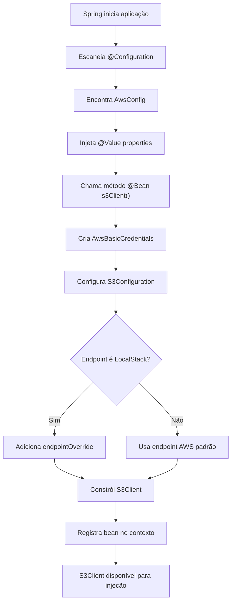

# Análise Completa da Classe AwsConfig - Configuração AWS S3
---
@import "AwsConfig.java" {.line-numbers}

---
## 📋 Índice

1. [Visão Geral da Classe](#-visão-geral-da-classe)
2. [Anatomia da Classe](#-anatomia-da-classe)
3. [Injeção de Propriedades](#-injeção-de-propriedades)
4. [Método Factory - s3Client()](#-método-factory---s3client)
5. [Configuração de Credenciais](#-configuração-de-credenciais)
6. [Configuração do S3](#-configuração-do-s3)
7. [Construção do Cliente S3](#-construção-do-cliente-s3)
8. [Lógica Inteligente de Endpoint](#-lógica-inteligente-de-endpoint)
9. [Fluxo de Criação do Bean](#-fluxo-de-criação-do-bean)
10. [Melhorias Sugeridas](#-melhorias-sugeridas)
11. [Uso da Configuração na Aplicação](#-uso-da-configuração-na-aplicação)
12. [Vantagens da Implementação](#-vantagens-da-implementação)
13. [Conclusão](#-conclusão)

---

Vou explicar detalhadamente esta classe fundamental, Bianeck! A `AwsConfig` é o **coração da integração** com AWS S3 e demonstra um design muito inteligente que funciona tanto para desenvolvimento quanto produção.

## 📋 Visão Geral da Classe

A `AwsConfig` é como um **"tradutor universal"** que permite sua aplicação conversar com diferentes "dialetos" do S3:
- **LocalStack** (desenvolvimento local)
- **AWS S3 Real** (produção)
- **Outros provedores S3-compatíveis** (MinIO, etc.)

**Analogia**: É como ter um **adaptador universal** que funciona em qualquer tomada do mundo - você conecta seu aparelho e ele se adapta automaticamente ao padrão local.

[🔝 Voltar ao Índice](#-índice)

---

## 🏗️ Anatomia da Classe

### 🏷️ Anotações e Metadados

```java {.line-numbers}
@Configuration
public class AwsConfig {
```

**`@Configuration`** transforma esta classe em uma **"fábrica de componentes"** do Spring:
- Spring **escaneia** esta classe na inicialização
- **Registra** todos os métodos `@Bean` no contexto
- **Gerencia** o ciclo de vida dos objetos criados
- **Injeta** dependências automaticamente

**Analogia**: É como uma **fábrica automatizada** que produz peças (beans) sob demanda e as entrega onde são necessárias.

[🔝 Voltar ao Índice](#-índice)

---

## 🎯 Injeção de Propriedades

```java {.line-numbers}
@Value("${aws.s3.endpoint}")
private String s3Endpoint;

@Value("${aws.s3.region}")
private String region;

@Value("${aws.s3.access-key}")
private String accessKey;

@Value("${aws.s3.secret-key}")
private String secretKey;

@Value("${aws.s3.path-style-access:true}")
private boolean pathStyleAccess;
```

### 🎯 Como Funciona a Injeção @Value

**`@Value("${propriedade}")`** é como um **"cabo de extensão"** que conecta:
- **Arquivo de configuração** (`application.yml`)
- **Variáveis de ambiente** do sistema
- **Argumentos da linha de comando**
- **Propriedades do sistema Java**

### 📊 Hierarquia de Resolução

<table class="data-table">
  <thead>
    <tr>
      <th scope="col">Prioridade</th>
      <th scope="col">Fonte</th>
      <th scope="col">Exemplo</th>
      <th scope="col">Quando Usar</th>
    </tr>
  </thead>
  <tbody>
    <tr>
      <td>1 (Maior)</td>
      <td>Linha de comando</td>
      <td>--aws.s3.endpoint=http://prod-s3</td>
      <td>Override temporário</td>
    </tr>
    <tr>
      <td>2</td>
      <td>Variáveis de ambiente</td>
      <td>AWS_S3_ENDPOINT=http://prod-s3</td>
      <td>Deployment/Docker</td>
    </tr>
    <tr>
      <td>3</td>
      <td>application-{profile}.yml</td>
      <td>application-prod.yml</td>
      <td>Configuração por ambiente</td>
    </tr>
    <tr>
      <td>4 (Menor)</td>
      <td>application.yml</td>
      <td>Configuração padrão</td>
      <td>Valores padrão</td>
    </tr>
  </tbody>
</table>

### 🛡️ Valor Padrão com Fallback

**`@Value("${aws.s3.path-style-access:true}")`**

A sintaxe `:true` é um **"plano B"**:
- **Se existe** a propriedade `aws.s3.path-style-access` → usa ela
- **Se não existe** → usa `true` como padrão

**Exemplo prático:**
```yaml
# Se no application.yml você tem:
aws:
  s3:
    path-style-access: false  # Usa false

# Se você não definir a propriedade:
# aws:
#   s3:
#     # path-style-access não definido
# Usa true (valor padrão)
```

[🔝 Voltar ao Índice](#-índice)

---

## 🏭 Método Factory - s3Client()

```java {.line-numbers}
@Bean
public S3Client s3Client() {
    // Implementação...
}
```

### 🎯 O que é um @Bean?

**`@Bean`** é como uma **"receita de bolo"** que o Spring executa:
- **Uma vez** durante a inicialização (singleton por padrão)
- **Resultado** fica disponível para injeção em toda aplicação
- **Gerenciamento automático** do ciclo de vida

**Analogia**: É como ter um **chef especializado** que prepara um prato específico (S3Client) uma vez e depois serve para todos que pedirem.

[🔝 Voltar ao Índice](#-índice)

---

## 🔐 Configuração de Credenciais

```java {.line-numbers}
var credentialsProvider = StaticCredentialsProvider.create(
        AwsBasicCredentials.create(accessKey, secretKey)
);
```

### 🔑 Tipos de Credenciais AWS

**StaticCredentialsProvider** é o mais **simples e direto**:
- **Credenciais fixas** (access key + secret key)
- **Ideal** para desenvolvimento e testes
- **Não recomendado** para produção (use IAM Roles)

**Alternativas para produção:**
```java {.line-numbers}
// 1. Credenciais padrão (recomendado para produção)
var credentialsProvider = DefaultCredentialsProvider.create();

// 2. Perfil específico
var credentialsProvider = ProfileCredentialsProvider.create("meu-perfil");

// 3. IAM Role (ideal para EC2/ECS)
var credentialsProvider = InstanceProfileCredentialsProvider.create();

// 4. Credenciais temporárias (STS)
var credentialsProvider = StsAssumeRoleCredentialsProvider.builder()
    .roleArn("arn:aws:iam::123456789012:role/MyRole")
    .roleSessionName("my-session")
    .build();
```

[🔝 Voltar ao Índice](#-índice)

---

## ⚙️ Configuração do S3

```java {.line-numbers}
var s3ConfigBuilder = S3Configuration.builder()
        .pathStyleAccessEnabled(pathStyleAccess);
```

### 🛣️ Path Style vs Virtual Hosted Style

**Path Style Access** define o **formato das URLs** do S3:

**Path Style (pathStyleAccess = true):**
```
http://s3.amazonaws.com/meu-bucket/arquivo.jpg
http://localhost:4566/meu-bucket/arquivo.jpg  ← LocalStack
```

**Virtual Hosted Style (pathStyleAccess = false):**
```
http://meu-bucket.s3.amazonaws.com/arquivo.jpg
```

### 🎯 Por que usar Path Style?

**LocalStack** e muitos **S3-compatíveis** não suportam virtual hosted style:
- **LocalStack**: Não consegue criar subdomínios dinâmicos
- **MinIO**: Funciona melhor com path style
- **Desenvolvimento**: Mais simples de configurar

[🔝 Voltar ao Índice](#-índice)

---

## 🏗️ Construção do Cliente S3

```java {.line-numbers}
var clientBuilder = S3Client.builder()
        .region(Region.of(region))
        .credentialsProvider(credentialsProvider)
        .serviceConfiguration(s3ConfigBuilder.build());
```

### 🌍 Configuração de Região

**`Region.of(region)`** especifica onde seus dados ficarão:
- **us-east-1**: Norte da Virgínia (padrão, mais barato)
- **us-west-2**: Oregon (boa latência para costa oeste)
- **eu-west-1**: Irlanda (GDPR compliance)
- **sa-east-1**: São Paulo (dados no Brasil)

**Impacto prático:**
```java {.line-numbers}
// Região afeta:
// 1. Latência de acesso
// 2. Custos de transferência
// 3. Compliance legal
// 4. Disponibilidade de serviços
```

[🔝 Voltar ao Índice](#-índice)

---

## 🧠 Lógica Inteligente de Endpoint

```java {.line-numbers}
// Se não for produção, usa o endpoint do LocalStack
if (s3Endpoint != null && !s3Endpoint.isEmpty() &&
        !s3Endpoint.contains("amazonaws.com")) {
    clientBuilder.endpointOverride(URI.create(s3Endpoint));
}
```

### 🎯 Análise da Condição

Esta é uma **lógica muito inteligente** que detecta automaticamente o ambiente:

**Condições verificadas:**
1. **`s3Endpoint != null`**: Endpoint foi configurado
2. **`!s3Endpoint.isEmpty()`**: Endpoint não está vazio
3. **`!s3Endpoint.contains("amazonaws.com")`**: Não é AWS real

**Cenários de uso:**

### 🏠 Desenvolvimento Local
```yaml
# application.yml
aws:
  s3:
    endpoint: http://localhost:4566  # ✅ Usa override
```

### 🐳 Docker/CI
```yaml
# application-test.yml
aws:
  s3:
    endpoint: http://localstack:4566  # ✅ Usa override
```

### 🏭 Produção AWS
```yaml
# application-prod.yml
aws:
  s3:
    endpoint: ""  # ✅ Não usa override (AWS padrão)
    # ou simplesmente omitir a propriedade
```

### 🔧 Outros Provedores S3
```yaml
# MinIO, DigitalOcean Spaces, etc.
aws:
  s3:
    endpoint: https://minio.exemplo.com  # ✅ Usa override
```

[🔝 Voltar ao Índice](#-índice)

---

## 🎯 Fluxo de Criação do Bean



[🔝 Voltar ao Índice](#-índice)

---

## 🔧 Melhorias Sugeridas

### 1. 🛡️ Configuração Mais Segura

```java {.line-numbers}
@Configuration
@Slf4j
public class AwsConfig {
    
    @Bean
    public S3Client s3Client() {
        // Log da configuração (sem credenciais!)
        log.info("Configurando S3Client - Região: {}, Endpoint: {}, PathStyle: {}", 
                 region, s3Endpoint, pathStyleAccess);
        
        var credentialsProvider = createCredentialsProvider();
        var s3Config = createS3Configuration();
        
        var clientBuilder = S3Client.builder()
                .region(Region.of(region))
                .credentialsProvider(credentialsProvider)
                .serviceConfiguration(s3Config)
                .overrideConfiguration(createClientOverrideConfig());
        
        configureEndpoint(clientBuilder);
        
        return clientBuilder.build();
    }
    
    private AwsCredentialsProvider createCredentialsProvider() {
        // Lógica mais sofisticada para credenciais
        if (isProductionEnvironment()) {
            return DefaultCredentialsProvider.create();
        }
        return StaticCredentialsProvider.create(
            AwsBasicCredentials.create(accessKey, secretKey));
    }
    
    private boolean isProductionEnvironment() {
        return s3Endpoint == null || s3Endpoint.isEmpty() || 
               s3Endpoint.contains("amazonaws.com");
    }
}
```

### 2. ⚡ Configurações de Performance

```java {.line-numbers}
private ClientOverrideConfiguration createClientOverrideConfig() {
    return ClientOverrideConfiguration.builder()
            .retryPolicy(RetryPolicy.builder()
                .numRetries(3)
                .build())
            .apiCallTimeout(Duration.ofSeconds(30))
            .apiCallAttemptTimeout(Duration.ofSeconds(10))
            .build();
}
```

### 3. 🔄 Configuração de HTTP Client

```java {.line-numbers}
@Bean
public S3Client s3Client() {
    var httpClient = UrlConnectionHttpClient.builder()
            .connectionTimeout(Duration.ofSeconds(5))
            .socketTimeout(Duration.ofSeconds(30))
            .build();
    
    return S3Client.builder()
            .region(Region.of(region))
            .credentialsProvider(credentialsProvider)
            .serviceConfiguration(s3Config)
            .httpClient(httpClient)  // Cliente HTTP customizado
            .build();
}
```

### 4. 🧪 Configuração Condicional por Profile

```java {.line-numbers}
@Configuration
public class AwsConfig {
    
    @Bean
    @Profile("!production")
    public S3Client localS3Client() {
        // Configuração específica para desenvolvimento
        return S3Client.builder()
                .region(Region.of(region))
                .credentialsProvider(StaticCredentialsProvider.create(
                    AwsBasicCredentials.create("test", "test")))
                .serviceConfiguration(S3Configuration.builder()
                    .pathStyleAccessEnabled(true)
                    .build())
                .endpointOverride(URI.create(s3Endpoint))
                .build();
    }
    
    @Bean
    @Profile("production")
    public S3Client productionS3Client() {
        // Configuração específica para produção
        return S3Client.builder()
                .region(Region.of(region))
                .credentialsProvider(DefaultCredentialsProvider.create())
                .serviceConfiguration(S3Configuration.builder()
                    .pathStyleAccessEnabled(false)
                    .build())
                .build();
    }
}
```

[🔝 Voltar ao Índice](#-índice)

---

## 🎯 Uso da Configuração na Aplicação

### 💉 Injeção do S3Client

```java {.line-numbers}
@Service
public class FileServiceImpl implements FileService {
    
    private final S3Client s3Client;  // ← Injetado automaticamente
    
    public FileServiceImpl(S3Client s3Client) {
        this.s3Client = s3Client;
    }
    
    @Override
    public FileInfoDto uploadFile(MultipartFile file) {
        // Usa o s3Client configurado
        var response = s3Client.putObject(putObjectRequest, requestBody);
        return createFileInfo(response);
    }
}
```

### 🧪 Teste da Configuração

```java {.line-numbers}
@SpringBootTest
@ActiveProfiles("test")
class AwsConfigTest {
    
    @Autowired
    private S3Client s3Client;
    
    @Test
    void shouldCreateS3ClientWithCorrectConfiguration() {
        assertThat(s3Client).isNotNull();
        
        // Verifica se consegue fazer operações básicas
        var listBucketsResponse = s3Client.listBuckets();
        assertThat(listBucketsResponse).isNotNull();
    }
}
```

[🔝 Voltar ao Índice](#-índice)

---

## �� Vantagens da Implementação

### ✅ **Flexibilidade**
- **Funciona** em desenvolvimento (LocalStack) e produção (AWS)
- **Configuração externa** via properties
- **Fácil troca** entre ambientes

### ✅ **Simplicidade**
- **Uma única configuração** para todos os cenários
- **Detecção automática** do ambiente
- **Código limpo** e bem documentado

### ✅ **Manutenibilidade**
- **Centralização** da configuração AWS
- **Fácil modificação** sem afetar outras classes
- **Testabilidade** com diferentes configurações

### ✅ **Segurança**
- **Suporte** a diferentes tipos de credenciais
- **Configuração segura** para produção
- **Isolamento** de configurações sensíveis

[🔝 Voltar ao Índice](#-índice)

---

## 🎯 Conclusão

A classe `AwsConfig` é um **excelente exemplo** de configuração Spring Boot profissional. Ela demonstra:

### 🌟 **Design Inteligente**
- **Adaptação automática** entre ambientes
- **Configuração flexível** via properties
- **Lógica robusta** de detecção de ambiente

### 🚀 **Boas Práticas**
- **Injeção de dependência** adequada
- **Separação de responsabilidades** clara
- **Documentação** completa e útil
- **Código limpo** e legível

Esta configuração serve como um **template exemplar** para integração AWS em projetos Spring Boot, Bianeck! Ela equilibra simplicidade, flexibilidade e robustez de forma magistral.

[🔝 Voltar ao Índice](#-índice)