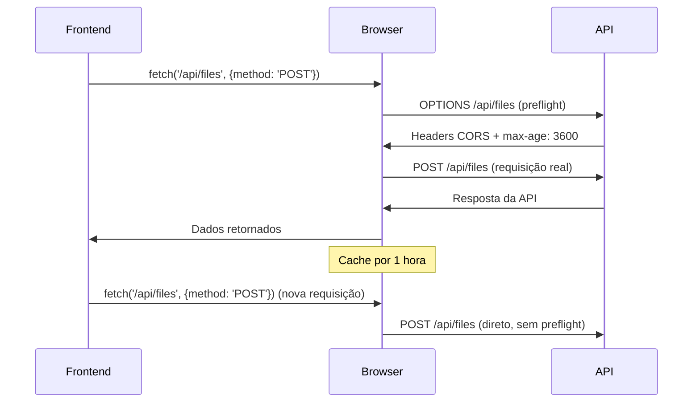
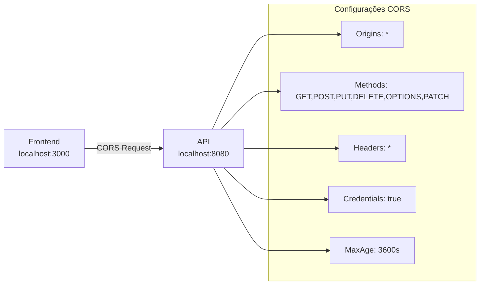

# Análise Completa da Classe CorsConfig - Configuração CORS
---
@import "CorsConfig.java" {.line-numbers}

---

## 📋 Índice

1. [O que é CORS e Por que Precisamos Dele](#-o-que-é-cors-e-por-que-precisamos-dele)
2. [Anatomia da Classe CorsConfig](#-anatomia-da-classe-corsconfig)
3. [Implementação WebMvcConfigurer](#-implementação-webmvcconfigurer)
4. [Bean CorsConfigurationSource](#-bean-corsconfigurationsource)
5. [Configurações CORS Detalhadas](#-configurações-cors-detalhadas)
6. [Comparação entre as Duas Abordagens](#-comparação-entre-as-duas-abordagens)
7. [Cenários de Uso Práticos](#-cenários-de-uso-práticos)
8. [Considerações de Segurança](#-considerações-de-segurança)
9. [Melhorias Sugeridas](#-melhorias-sugeridas)
10. [Testes da Configuração CORS](#-testes-da-configuração-cors)
11. [Conclusão](#-conclusão)

---

Vou explicar detalhadamente esta classe fundamental para comunicação entre frontend e backend, Bianeck! A `CorsConfig` é o **"porteiro diplomático"** da sua API, decidindo quem pode entrar e como.

## 🌐 O que é CORS e Por que Precisamos Dele

### 🛡️ CORS (Cross-Origin Resource Sharing)

**CORS** é como um **"sistema de segurança"** dos navegadores que protege usuários de ataques maliciosos. Imagine que é como ter um **porteiro rigoroso** em um prédio que só deixa entrar pessoas autorizadas.

**Analogia prática**: É como o **controle de acesso** de um condomínio:
- **Moradores** (mesmo domínio): Entram livremente
- **Visitantes** (outros domínios): Precisam de autorização
- **Entregadores** (APIs): Precisam de permissão específica

### 🚫 Same-Origin Policy (Política de Mesma Origem)

Por padrão, navegadores **bloqueiam** requisições entre diferentes origens:

```java {.line-numbers}script
// ✅ PERMITIDO (mesma origem)
fetch('http://localhost:3000/api/files')  // Frontend em localhost:3000

// ❌ BLOQUEADO (origem diferente)
fetch('http://localhost:8080/api/files')  // API em localhost:8080
```

### 🔓 Como CORS Resolve o Problema

CORS permite que o **servidor** (sua API) diga ao **navegador**:
*"Ei, é seguro! Pode deixar esse site fazer requisições para mim."*

[🔝 Voltar ao Índice](#-índice)

---

## 🏗️ Anatomia da Classe CorsConfig

```java {.line-numbers}
@Configuration
public class CorsConfig implements WebMvcConfigurer {
```

### 🎯 Duas Estratégias em Uma Classe

Esta classe implementa **duas abordagens** diferentes para configurar CORS:

1. **WebMvcConfigurer**: Configuração via interface (mais simples)
2. **@Bean CorsConfigurationSource**: Configuração via bean (mais flexível)

**Por que duas abordagens?**
- **Redundância**: Garante que CORS funcione em diferentes cenários
- **Compatibilidade**: Funciona com Spring Security e sem ele
- **Flexibilidade**: Permite configurações específicas por situação

**Analogia**: É como ter **duas chaves** para a mesma porta - se uma não funcionar, a outra funciona!

[🔝 Voltar ao Índice](#-índice)

---

## 🔧 Implementação WebMvcConfigurer

```java {.line-numbers}
@Override
public void addCorsMappings(CorsRegistry registry) {
    registry.addMapping("/api/**")
            .allowedOriginPatterns("*")
            .allowedMethods("GET", "POST", "PUT", "DELETE", "OPTIONS", "PATCH")
            .allowedHeaders("*")
            .allowCredentials(true)
            .maxAge(3600);
}
```

### 🎯 Configuração Passo a Passo

**`registry.addMapping("/api/**")`**
- **Aplica** as regras CORS apenas para URLs que começam com `/api/`
- **Protege** outras rotas que não precisam de CORS
- **Corresponde** ao context-path definido no `application.yml`

**Exemplo prático:**
```
✅ http://localhost:8080/api/files        → CORS aplicado
✅ http://localhost:8080/api/files/upload → CORS aplicado
❌ http://localhost:8080/actuator/health  → CORS NÃO aplicado
❌ http://localhost:8080/swagger-ui.html  → CORS NÃO aplicado
```

### 🌍 Origens Permitidas

**`.allowedOriginPatterns("*")`**
- **Permite** requisições de **qualquer origem**
- **Mais flexível** que `allowedOrigins()` 
- **Suporta** padrões com wildcards

**Diferença importante:**
```java {.line-numbers}
// ❌ Não funciona com credentials
.allowedOrigins("*")

// ✅ Funciona com credentials
.allowedOriginPatterns("*")
```

### 🛠️ Métodos HTTP Permitidos

**`.allowedMethods("GET", "POST", "PUT", "DELETE", "OPTIONS", "PATCH")`**

Cada método tem um **propósito específico** na sua API:

<table class="data-table">
  <thead>
    <tr>
      <th scope="col">Método</th>
      <th scope="col">Uso na API</th>
      <th scope="col">Exemplo</th>
    </tr>
  </thead>
  <tbody>
    <tr>
      <td>GET</td>
      <td>Buscar dados</td>
      <td>Listar arquivos, baixar arquivo</td>
    </tr>
    <tr>
      <td>POST</td>
      <td>Criar recursos</td>
      <td>Upload de arquivo, gerar URL pré-assinada</td>
    </tr>
    <tr>
      <td>PUT</td>
      <td>Atualizar recursos</td>
      <td>Substituir arquivo existente</td>
    </tr>
    <tr>
      <td>DELETE</td>
      <td>Remover recursos</td>
      <td>Excluir arquivo</td>
    </tr>
    <tr>
      <td>PATCH</td>
      <td>Atualização parcial</td>
      <td>Atualizar metadados do arquivo</td>
    </tr>
    <tr>
      <td>OPTIONS</td>
      <td>Preflight request</td>
      <td>Verificação automática do navegador</td>
    </tr>
  </tbody>
</table>

### 📋 Headers Permitidos

**`.allowedHeaders("*")`**
- **Permite** todos os headers nas requisições
- **Inclui** headers customizados do frontend
- **Essencial** para APIs modernas

**Headers comuns em APIs:**
```java {.line-numbers}script
// Frontend pode enviar qualquer header
fetch('/api/files', {
  headers: {
    'Content-Type': 'application/json',
    'Authorization': 'Bearer token123',
    'X-Custom-Header': 'valor-customizado',
    'X-Request-ID': 'req-12345'
  }
});
```

### 🍪 Credenciais Permitidas

**`.allowCredentials(true)`**
- **Permite** envio de **cookies**, **tokens** e **headers de autenticação**
- **Essencial** para autenticação baseada em sessão
- **Requerido** para muitas aplicações modernas

**Exemplo prático:**
```java {.line-numbers}script
// Frontend pode enviar cookies e headers de auth
fetch('/api/files', {
  credentials: 'include',  // Inclui cookies
  headers: {
    'Authorization': 'Bearer ' + localStorage.getItem('token')
  }
});
```

### ⏱️ Cache de Preflight

**`.maxAge(3600)`**
- **Cache** por **3600 segundos** (1 hora)
- **Reduz** requisições OPTIONS desnecessárias
- **Melhora** performance da aplicação

**Como funciona:**


[🔝 Voltar ao Índice](#-índice)

---

## 🏭 Bean CorsConfigurationSource

```java {.line-numbers}
@Bean
public CorsConfigurationSource corsConfigurationSource() {
    CorsConfiguration configuration = new CorsConfiguration();
    configuration.setAllowedOriginPatterns(List.of("*"));
    configuration.setAllowedMethods(Arrays.asList("GET", "POST", "PUT", "DELETE", "OPTIONS", "PATCH"));
    configuration.setAllowedHeaders(List.of("*"));
    configuration.setAllowCredentials(true);
    configuration.setMaxAge(3600L);

    UrlBasedCorsConfigurationSource source = new UrlBasedCorsConfigurationSource();
    source.registerCorsConfiguration("/**", configuration);
    return source;
}
```

### 🎯 Por que um Bean Separado?

Este bean é **especialmente importante** quando você usa **Spring Security**:

```java {.line-numbers}
// Spring Security usa este bean automaticamente
@EnableWebSecurity
public class SecurityConfig {
    
    @Bean
    public SecurityFilterChain filterChain(HttpSecurity http) throws Exception {
        return http
            .cors(Customizer.withDefaults())  // ← Usa o CorsConfigurationSource
            .csrf(csrf -> csrf.disable())
            .build();
    }
}
```

### 🗺️ Mapeamento de URLs

**`source.registerCorsConfiguration("/**", configuration)`**
- **Aplica** CORS para **todas** as URLs (`/**`)
- **Mais amplo** que o WebMvcConfigurer (`/api/**`)
- **Garante** cobertura completa

**Diferença de cobertura:**
```
WebMvcConfigurer: /api/**
✅ /api/files
✅ /api/files/upload
❌ /actuator/health
❌ /swagger-ui.html

CorsConfigurationSource: /**
✅ /api/files
✅ /api/files/upload
✅ /actuator/health
✅ /swagger-ui.html
```

[🔝 Voltar ao Índice](#-índice)

---

## ⚙️ Configurações CORS Detalhadas

### 🎨 Configuração Visual das Permissões



### 🔍 Análise de Cada Configuração

**1. Allowed Origin Patterns**
```java {.line-numbers}
configuration.setAllowedOriginPatterns(List.of("*"));
```
- **Desenvolvimento**: Permite qualquer origem
- **Produção**: Deveria ser mais restritivo
- **Flexibilidade**: Suporta padrões complexos

**2. Allowed Methods**
```java {.line-numbers}
configuration.setAllowedMethods(Arrays.asList("GET", "POST", "PUT", "DELETE", "OPTIONS", "PATCH"));
```
- **Completo**: Suporta todas as operações REST
- **OPTIONS**: Necessário para preflight requests
- **Flexível**: Permite operações CRUD completas

**3. Allowed Headers**
```java {.line-numbers}
configuration.setAllowedHeaders(List.of("*"));
```
- **Permissivo**: Aceita qualquer header
- **Conveniente**: Não bloqueia headers customizados
- **Cuidado**: Pode ser muito permissivo para produção

**4. Allow Credentials**
```java {.line-numbers}
configuration.setAllowCredentials(true);
```
- **Autenticação**: Permite cookies e tokens
- **Sessões**: Suporta autenticação baseada em sessão
- **Segurança**: Requer origins específicas (não `*`)

**5. Max Age**
```java {.line-numbers}
configuration.setMaxAge(3600L);
```
- **Performance**: Reduz preflight requests
- **Cache**: 1 hora de cache no navegador
- **Eficiência**: Melhora experiência do usuário

[🔝 Voltar ao Índice](#-índice)

---

## 🔄 Comparação entre as Duas Abordagens

### 📊 WebMvcConfigurer vs CorsConfigurationSource

<table class="data-table">
  <thead>
    <tr>
      <th scope="col">Aspecto</th>
      <th scope="col">WebMvcConfigurer</th>
      <th scope="col">CorsConfigurationSource</th>
    </tr>
  </thead>
  <tbody>
    <tr>
      <td>Escopo</td>
      <td>/api/** (específico)</td>
      <td>/** (global)</td>
    </tr>
    <tr>
      <td>Spring Security</td>
      <td>Pode não funcionar</td>
      <td>Integração automática</td>
    </tr>
    <tr>
      <td>Simplicidade</td>
      <td>Mais simples</td>
      <td>Mais verboso</td>
    </tr>
    <tr>
      <td>Flexibilidade</td>
      <td>Limitada</td>
      <td>Máxima</td>
    </tr>
    <tr>
      <td>Uso Recomendado</td>
      <td>APIs simples</td>
      <td>Aplicações com Security</td>
    </tr>
  </tbody>
</table>

### 🎯 Quando Usar Cada Abordagem

**Use WebMvcConfigurer quando:**
- **Aplicação simples** sem Spring Security
- **CORS específico** para certas rotas
- **Configuração básica** é suficiente

**Use CorsConfigurationSource quando:**
- **Spring Security** está habilitado
- **Configuração global** é necessária
- **Flexibilidade máxima** é requerida

[🔝 Voltar ao Índice](#-índice)

---

## 🌐 Cenários de Uso Práticos

### 1. 🖥️ Desenvolvimento Local

**Cenário**: Frontend React em `localhost:3000`, API em `localhost:8080`

```java {.line-numbers}script
// Frontend (React)
const uploadFile = async (file) => {
  const formData = new FormData();
  formData.append('file', file);
  
  const response = await fetch('http://localhost:8080/api/files/upload', {
    method: 'POST',
    body: formData,
    credentials: 'include'  // ← Funciona graças ao CORS
  });
  
  return response.json();
};
```

### 2. 📱 Aplicação Mobile (PWA)

**Cenário**: PWA servida de `https://meuapp.com`, API em `https://api.meuapp.com`

```java {.line-numbers}script
// PWA
const downloadFile = async (fileKey) => {
  const response = await fetch(`https://api.meuapp.com/api/files/download/${fileKey}`, {
    method: 'GET',
    headers: {
      'Authorization': `Bearer ${getToken()}`,
      'X-App-Version': '1.2.3'
    },
    credentials: 'include'
  });
  
  return response.blob();
};
```

### 3. 🔧 Integração com Terceiros

**Cenário**: Dashboard externo consumindo sua API

```java {.line-numbers}script
// Dashboard de terceiros
const getFileStats = async () => {
  const response = await fetch('https://sua-api.com/api/files/stats', {
    method: 'GET',
    headers: {
      'API-Key': 'sua-api-key',
      'Content-Type': 'application/json'
    }
  });
  
  return response.json();
};
```

[🔝 Voltar ao Índice](#-índice)

---

## 🛡️ Considerações de Segurança

### ⚠️ Configuração Atual (Desenvolvimento)

A configuração atual é **muito permissiva** e adequada apenas para **desenvolvimento**:

```java {.line-numbers}
.allowedOriginPatterns("*")     // ⚠️ Qualquer origem
.allowedHeaders("*")            // ⚠️ Qualquer header
.allowCredentials(true)         // ⚠️ Com credenciais
```

### 🔒 Riscos de Segurança

**1. Origem Wildcard com Credenciais**
- **Risco**: Qualquer site pode fazer requisições autenticadas
- **Ataque**: Site malicioso pode roubar dados do usuário
- **Solução**: Especificar origens exatas em produção

**2. Headers Irrestritos**
- **Risco**: Headers maliciosos podem ser injetados
- **Ataque**: Bypass de validações de segurança
- **Solução**: Listar headers específicos necessários

**3. Métodos Excessivos**
- **Risco**: Operações não intencionais podem ser executadas
- **Ataque**: Modificação/exclusão não autorizada
- **Solução**: Permitir apenas métodos necessários

### 🏭 Configuração para Produção

```java {.line-numbers}
@Profile("production")
@Configuration
public class ProductionCorsConfig implements WebMvcConfigurer {
    
    @Override
    public void addCorsMappings(CorsRegistry registry) {
        registry.addMapping("/api/**")
                .allowedOriginPatterns(
                    "https://meuapp.com",
                    "https://*.meuapp.com",
                    "https://app.meudominio.com"
                )
                .allowedMethods("GET", "POST", "PUT", "DELETE", "OPTIONS")
                .allowedHeaders(
                    "Content-Type",
                    "Authorization",
                    "X-Requested-With",
                    "X-API-Key"
                )
                .allowCredentials(true)
                .maxAge(3600);
    }
}
```

[🔝 Voltar ao Índice](#-índice)

---

## 🔧 Melhorias Sugeridas

### 1. 🎯 Configuração por Environment

```java {.line-numbers}
@Configuration
public class CorsConfig implements WebMvcConfigurer {
    
    @Value("${app.cors.allowed-origins:*}")
    private List<String> allowedOrigins;
    
    @Value("${app.cors.allowed-methods:GET,POST,PUT,DELETE,OPTIONS,PATCH}")
    private List<String> allowedMethods;
    
    @Value("${app.cors.allowed-headers:*}")
    private List<String> allowedHeaders;
    
    @Value("${app.cors.allow-credentials:true}")
    private boolean allowCredentials;
    
    @Value("${app.cors.max-age:3600}")
    private long maxAge;
    
    @Override
    public void addCorsMappings(CorsRegistry registry) {
        registry.addMapping("/api/**")
                .allowedOriginPatterns(allowedOrigins.toArray(new String[0]))
                .allowedMethods(allowedMethods.toArray(new String[0]))
                .allowedHeaders(allowedHeaders.toArray(new String[0]))
                .allowCredentials(allowCredentials)
                .maxAge(maxAge);
    }
}
```

**Configuração por ambiente:**
```yaml
# application-dev.yml
app:
  cors:
    allowed-origins: "*"
    allowed-headers: "*"
    allow-credentials: true

# application-prod.yml
app:
  cors:
    allowed-origins: 
      - "https://meuapp.com"
      - "https://*.meuapp.com"
    allowed-headers:
      - "Content-Type"
      - "Authorization"
      - "X-API-Key"
    allow-credentials: true
```

### 2. 📊 Logging de Requisições CORS

```java {.line-numbers}
@Component
@Slf4j
public class CorsLoggingFilter implements Filter {
    
    @Override
    public void doFilter(ServletRequest request, ServletResponse response, 
                        FilterChain chain) throws IOException, ServletException {
        
        HttpServletRequest httpRequest = (HttpServletRequest) request;
        String origin = httpRequest.getHeader("Origin");
        
        if (origin != null) {
            log.debug("CORS request from origin: {} to {}", 
                     origin, httpRequest.getRequestURI());
        }
        
        chain.doFilter(request, response);
    }
}
```

### 3. 🛡️ Validação de Origin Customizada

```java {.line-numbers}
@Component
public class CustomCorsProcessor {
    
    private final List<String> allowedOrigins = List.of(
        "https://meuapp.com",
        "https://app.meudominio.com"
    );
    
    public boolean isOriginAllowed(String origin) {
        if (origin == null) return false;
        
        // Validação customizada
        return allowedOrigins.stream()
                .anyMatch(allowed -> origin.matches(allowed.replace("*", ".*")));
    }
}
```

### 4. 🔧 Configuração Condicional

```java {.line-numbers}
@Configuration
@ConditionalOnProperty(name = "app.cors.enabled", havingValue = "true", matchIfMissing = true)
public class CorsConfig implements WebMvcConfigurer {
    
    @ConditionalOnProperty(name = "spring.profiles.active", havingValue = "development")
    @Bean
    public CorsConfigurationSource developmentCorsConfigurationSource() {
        // Configuração permissiva para desenvolvimento
        return createCorsConfigurationSource(true);
    }
    
    @ConditionalOnProperty(name = "spring.profiles.active", havingValue = "production")
    @Bean
    public CorsConfigurationSource productionCorsConfigurationSource() {
        // Configuração restritiva para produção
        return createCorsConfigurationSource(false);
    }
    
    private CorsConfigurationSource createCorsConfigurationSource(boolean permissive) {
        // Lógica de criação baseada no ambiente
    }
}
```

[🔝 Voltar ao Índice](#-índice)

---

## 🧪 Testes da Configuração CORS

### 1. 🔬 Teste de Integração

```java {.line-numbers}
@SpringBootTest(webEnvironment = SpringBootTest.WebEnvironment.RANDOM_PORT)
@ActiveProfiles("test")
class CorsConfigTest {
    
    @Autowired
    private TestRestTemplate restTemplate;
    
    @LocalServerPort
    private int port;
    
    @Test
    void shouldAllowCorsRequestFromAnyOrigin() {
        HttpHeaders headers = new HttpHeaders();
        headers.set("Origin", "http://localhost:3000");
        
        HttpEntity<String> entity = new HttpEntity<>(headers);
        
        ResponseEntity<String> response = restTemplate.exchange(
            "http://localhost:" + port + "/api/files",
            HttpMethod.OPTIONS,
            entity,
            String.class
        );
        
        assertThat(response.getStatusCode()).isEqualTo(HttpStatus.OK);
        assertThat(response.getHeaders().getAccessControlAllowOrigin())
            .isEqualTo("http://localhost:3000");
    }
    
    @Test
    void shouldAllowCredentials() {
        HttpHeaders headers = new HttpHeaders();
        headers.set("Origin", "http://localhost:3000");
        
        HttpEntity<String> entity = new HttpEntity<>(headers);
        
        ResponseEntity<String> response = restTemplate.exchange(
            "http://localhost:" + port + "/api/files",
            HttpMethod.OPTIONS,
            entity,
            String.class
        );
        
        assertThat(response.getHeaders().getAccessControlAllowCredentials())
            .isTrue();
    }
}
```

### 2. 🌐 Teste com MockMvc

```java {.line-numbers}
@WebMvcTest
class CorsWebMvcTest {
    
    @Autowired
    private MockMvc mockMvc;
    
    @Test
    void shouldHandlePreflightRequest() throws Exception {
        mockMvc.perform(options("/api/files")
                .header("Origin", "http://localhost:3000")
                .header("Access-Control-Request-Method", "POST")
                .header("Access-Control-Request-Headers", "Content-Type"))
                .andExpect(status().isOk())
                .andExpect(header().string("Access-Control-Allow-Origin", "http://localhost:3000"))
                .andExpect(header().string("Access-Control-Allow-Methods", containsString("POST")))
                .andExpect(header().string("Access-Control-Allow-Headers", "*"))
                .andExpect(header().string("Access-Control-Allow-Credentials", "true"));
    }
}
```

### 3. 🔧 Teste Manual com cURL

```bash
# Teste de preflight request
curl -X OPTIONS \
  http://localhost:8080/api/files \
  -H "Origin: http://localhost:3000" \
  -H "Access-Control-Request-Method: POST" \
  -H "Access-Control-Request-Headers: Content-Type" \
  -v

# Resposta esperada:
# Access-Control-Allow-Origin: http://localhost:3000
# Access-Control-Allow-Methods: GET,POST,PUT,DELETE,OPTIONS,PATCH
# Access-Control-Allow-Headers: *
# Access-Control-Allow-Credentials: true
# Access-Control-Max-Age: 3600
```

[🔝 Voltar ao Índice](#-índice)

---

## �� Conclusão

A classe `CorsConfig` é **fundamental** para permitir que frontends modernos consumam sua API. Ela demonstra:

### ✅ **Características Profissionais**
- **Dupla abordagem** para máxima compatibilidade
- **Configuração completa** para desenvolvimento
- **Flexibilidade** para diferentes cenários
- **Preparação** para integração com Spring Security

### 🚀 **Benefícios Práticos**
- **Desenvolvimento facilitado** com configuração permissiva
- **Suporte completo** a aplicações SPA (React, Vue, Angular)
- **Integração** com aplicações mobile e PWAs
- **Base sólida** para configurações de produção

### ⚠️ **Pontos de Atenção**
- **Configuração atual** é adequada apenas para desenvolvimento
- **Produção** requer configurações mais restritivas
- **Segurança** deve ser considerada ao definir origens permitidas

Esta configuração serve como um **excelente ponto de partida** para APIs modernas, Bianeck! Ela garante que sua aplicação funcione perfeitamente com frontends modernos enquanto mantém a flexibilidade para ajustes de segurança conforme necessário.

[🔝 Voltar ao Índice](#-índice)