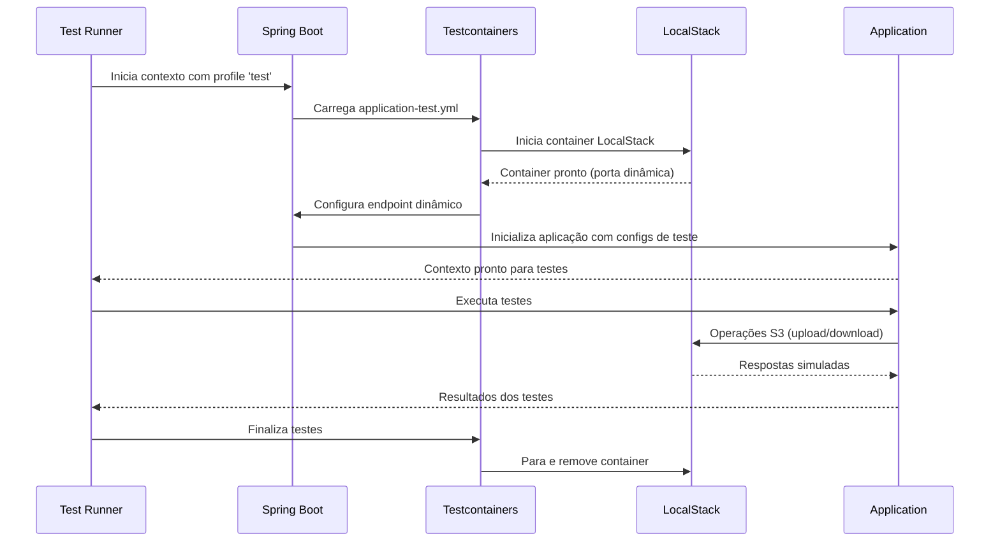

# Análise Completa do application-test.yml - Configurações de Teste

Vou explicar detalhadamente o arquivo `application-test.yml`, Bianeck! Este arquivo é fundamental para criar um **ambiente isolado e controlado** para seus testes automatizados.

## 📋 O que é o application-test.yml?

O `application-test.yml` é como um **"laboratório controlado"** para seus testes. Imagine que você está testando um novo remédio - você não faria isso em pacientes reais, mas sim em um ambiente controlado de laboratório. Da mesma forma, este arquivo cria um ambiente específico para testes, isolado da configuração de produção.

**Analogia prática**: É como ter uma **"versão de brinquedo"** da sua aplicação, onde você pode quebrar, testar e experimentar sem afetar o sistema real.

## 🔄 Ativação de Profile de Teste

```yaml
spring:
  profiles:
    active: test
```

### 🎯 O que são Spring Profiles?

**Spring Profiles** são como **"roupas diferentes"** que sua aplicação pode vestir dependendo da ocasião:
- **Desenvolvimento**: Roupa casual (logs detalhados, LocalStack)
- **Teste**: Roupa de laboratório (ambiente controlado, dados fictícios)
- **Produção**: Roupa formal (configurações otimizadas, segurança máxima)

### 🔧 Como Funciona a Ativação

**`active: test`** significa:
- Este arquivo **só será usado** quando o profile `test` estiver ativo
- **Sobrescreve** configurações do `application.yml` padrão
- **Isola** completamente o ambiente de teste

**Exemplo prático de uso:**
```bash
# Executar testes com profile específico
mvn test -Dspring.profiles.active=test

# Executar aplicação em modo teste
java -jar app.jar --spring.profiles.active=test

# No IDE (IntelliJ/Eclipse)
@ActiveProfiles("test")
public class FileServiceTest {
    // Testes aqui usarão as configurações de teste
}
```

## ☁️ Configurações AWS S3 para Testes

```yaml
aws:
  s3:
    bucket-name: test-bucket
    region: us-east-1
    endpoint: ${LOCALSTACK_ENDPOINT:http://localhost:4566}
    access-key: test
    secret-key: test
    path-style-access: true
```

### 🪣 Bucket de Teste Isolado

**`bucket-name: test-bucket`**
- **Bucket separado** exclusivamente para testes
- **Evita conflitos** com dados de desenvolvimento ou produção
- **Permite limpeza** completa após cada teste

**Vantagens do isolamento:**
```java
@BeforeEach
void setUp() {
    // Cria bucket limpo para cada teste
    s3Client.createBucket(CreateBucketRequest.builder()
        .bucket("test-bucket")
        .build());
}

@AfterEach
void tearDown() {
    // Remove todos os arquivos após o teste
    cleanupBucket("test-bucket");
}
```

### 🌍 Região Consistente

**`region: us-east-1`**
- **Mesma região** que desenvolvimento para consistência
- **Evita problemas** de configuração específica de região
- **LocalStack** aceita qualquer região, mas é boa prática manter consistência

### 🔗 Endpoint Flexível com Variável de Ambiente

**`endpoint: ${LOCALSTACK_ENDPOINT:http://localhost:4566}`**

Esta configuração é **muito inteligente**! Vamos decompor:

**Sintaxe**: `${VARIAVEL:valor_padrao}`
- **Se existe** a variável `LOCALSTACK_ENDPOINT` → usa ela
- **Se não existe** → usa `http://localhost:4566`

**Cenários de uso:**

### 🏠 Desenvolvimento Local
```bash
# Sem variável de ambiente
# Usa: http://localhost:4566
mvn test
```

### 🐳 CI/CD com Docker
```bash
# Com variável de ambiente customizada
export LOCALSTACK_ENDPOINT=http://localstack-container:4566
mvn test
# Usa: http://localstack-container:4566
```

### 🧪 Testcontainers Dinâmico
```java
@Testcontainers
class FileServiceIntegrationTest {
    
    @Container
    static LocalStackContainer localstack = new LocalStackContainer(DockerImageName.parse("localstack/localstack"))
        .withServices(LocalStackContainer.Service.S3);
    
    @DynamicPropertySource
    static void configureProperties(DynamicPropertyRegistry registry) {
        // Sobrescreve a configuração dinamicamente
        registry.add("aws.s3.endpoint", localstack::getEndpointOverride);
    }
}
```

### 🔐 Credenciais de Teste

**`access-key: test` e `secret-key: test`**
- **Credenciais fictícias** específicas para LocalStack
- **Não funcionam** na AWS real (segurança)
- **Consistentes** entre desenvolvimento e teste

**Por que usar credenciais fixas em teste:**
- **Reprodutibilidade**: Mesmos resultados sempre
- **Simplicidade**: Não precisa configurar credenciais reais
- **Segurança**: Impossível acidentalmente acessar recursos reais

## 📝 Configurações de Logging para Testes

```yaml
logging:
  level:
    com.bianeck.s3poc: DEBUG
    org.testcontainers: INFO
```

### 🔍 Logs da Aplicação em DEBUG

**`com.bianeck.s3poc: DEBUG`**
- **Logs detalhados** da sua aplicação durante testes
- **Facilita debugging** quando testes falham
- **Mostra fluxo completo** de execução

**Exemplo de logs úteis em testes:**
```
DEBUG - Iniciando upload do arquivo: test-document.pdf
DEBUG - Chave gerada: files/2024/01/test-document-abc123.pdf
DEBUG - Upload realizado com sucesso - ETag: d41d8cd98f00b204e9800998ecf8427e
DEBUG - Arquivo salvo no bucket: test-bucket
```

### 🐳 Logs do Testcontainers em INFO

**`org.testcontainers: INFO`**
- **Informações essenciais** sobre containers Docker
- **Não polui** os logs com detalhes desnecessários
- **Mostra** inicialização e finalização de containers

**Exemplo de logs do Testcontainers:**
```
INFO  - Creating container for image: localstack/localstack:latest
INFO  - Container localstack/localstack:latest is starting: 8f2a1b3c4d5e
INFO  - Container localstack/localstack:latest started in PT15.234S
INFO  - LocalStack container started on port: 45123
```

## 🎯 Comparação com Configuração Principal

### 📊 Diferenças Principais

<table class="data-table">
  <thead>
    <tr>
      <th scope="col">Configuração</th>
      <th scope="col">application.yml (Desenvolvimento)</th>
      <th scope="col">application-test.yml (Teste)</th>
      <th scope="col">Motivo da Diferença</th>
    </tr>
  </thead>
  <tbody>
    <tr>
      <td>Bucket Name</td>
      <td>aws-s3-poc-bucket</td>
      <td>test-bucket</td>
      <td>Isolamento de dados</td>
    </tr>
    <tr>
      <td>Endpoint</td>
      <td>http://localhost:4566</td>
      <td>${LOCALSTACK_ENDPOINT:http://localhost:4566}</td>
      <td>Flexibilidade para CI/CD</td>
    </tr>
    <tr>
      <td>Logs Testcontainers</td>
      <td>Não configurado</td>
      <td>INFO</td>
      <td>Controle específico para testes</td>
    </tr>
    <tr>
      <td>Profile</td>
      <td>Não especificado</td>
      <td>test</td>
      <td>Ativação automática</td>
    </tr>
  </tbody>
</table>

## 🧪 Casos de Uso Práticos

### 1. 🔄 Teste de Integração Básico

```java
@SpringBootTest
@ActiveProfiles("test")
@Testcontainers
class FileServiceIntegrationTest {
    
    @Container
    static LocalStackContainer localstack = new LocalStackContainer(DockerImageName.parse("localstack/localstack"))
        .withServices(LocalStackContainer.Service.S3);
    
    @Autowired
    private FileService fileService;
    
    @Test
    void shouldUploadAndDownloadFile() {
        // Arrange
        MockMultipartFile file = new MockMultipartFile(
            "file", "test.txt", "text/plain", "Hello World".getBytes());
        
        // Act
        FileInfoDto uploadedFile = fileService.uploadFile(file);
        Resource downloadedFile = fileService.downloadFile(uploadedFile.key());
        
        // Assert
        assertThat(uploadedFile.fileName()).isEqualTo("test.txt");
        assertThat(downloadedFile).isNotNull();
    }
}
```

### 2. 🏗️ Configuração Dinâmica com Testcontainers

```java
@SpringBootTest
@ActiveProfiles("test")
@Testcontainers
class DynamicConfigurationTest {
    
    @Container
    static LocalStackContainer localstack = new LocalStackContainer(DockerImageName.parse("localstack/localstack"))
        .withServices(LocalStackContainer.Service.S3)
        .withEnv("DEBUG", "1");
    
    @DynamicPropertySource
    static void configureProperties(DynamicPropertyRegistry registry) {
        // Sobrescreve configurações dinamicamente
        registry.add("aws.s3.endpoint", localstack::getEndpointOverride);
        registry.add("aws.s3.bucket-name", () -> "dynamic-test-bucket");
    }
    
    @Test
    void shouldUseDynamicConfiguration() {
        // Teste usando configurações dinâmicas
    }
}
```

### 3. 🎭 Teste com Múltiplos Profiles

```java
@SpringBootTest
@ActiveProfiles({"test", "integration"})
class MultiProfileTest {
    // Usa configurações de 'test' + 'integration'
    // application-test.yml + application-integration.yml
}
```

## 🔧 Melhorias Sugeridas

### 1. 📊 Configurações Específicas de Performance

```yaml
spring:
  profiles:
    active: test
  servlet:
    multipart:
      max-file-size: 1MB      # Menor para testes rápidos
      max-request-size: 5MB   # Reduzido para eficiência
      
aws:
  s3:
    bucket-name: test-bucket
    region: us-east-1
    endpoint: ${LOCALSTACK_ENDPOINT:http://localhost:4566}
    access-key: test
    secret-key: test
    path-style-access: true

# Configurações específicas para testes
app:
  file:
    max-size: 1048576  # 1MB para testes rápidos
    allowed-extensions:
      - txt
      - pdf
      - jpg  # Apenas extensões essenciais para testes

logging:
  level:
    com.bianeck.s3poc: DEBUG
    org.testcontainers: INFO
    software.amazon.awssdk: WARN  # Menos verboso
```

### 2. 🎯 Configurações de Timeout para Testes

```yaml
# Adicionar configurações de timeout
app:
  test:
    timeout:
      upload: 5000      # 5 segundos
      download: 3000    # 3 segundos
      connection: 2000  # 2 segundos
    
management:
  endpoints:
    web:
      exposure:
        include: health  # Apenas health para testes
```

### 3. 🧹 Configurações de Limpeza

```yaml
# Configurações para limpeza automática
app:
  test:
    cleanup:
      enabled: true
      delete-after-test: true
      max-test-files: 100
```

## 🚀 Integração com CI/CD

### 🐳 Docker Compose para Testes

```yaml
# docker-compose.test.yml
version: '3.8'
services:
  localstack:
    image: localstack/localstack:latest
    container_name: localstack-test
    ports:
      - "4566:4566"
    environment:
      - SERVICES=s3
      - DEBUG=1
    networks:
      - test-network

  app-test:
    build: .
    environment:
      - SPRING_PROFILES_ACTIVE=test
      - LOCALSTACK_ENDPOINT=http://localstack:4566
    depends_on:
      - localstack
    networks:
      - test-network
    command: mvn test

networks:
  test-network:
    driver: bridge
```

### 🔄 GitHub Actions

```yaml
# .github/workflows/test.yml
name: Tests
on: [push, pull_request]

jobs:
  test:
    runs-on: ubuntu-latest
    steps:
      - uses: actions/checkout@v3
      
      - name: Set up JDK 21
        uses: actions/setup-java@v3
        with:
          java-version: '21'
          distribution: 'temurin'
          
      - name: Start LocalStack
        run: |
          docker run -d \
            --name localstack \
            -p 4566:4566 \
            -e SERVICES=s3 \
            localstack/localstack:latest
            
      - name: Wait for LocalStack
        run: |
          until curl -s http://localhost:4566/health | grep -q '"s3": "available"'; do
            echo "Waiting for LocalStack..."
            sleep 2
          done
          
      - name: Run Tests
        run: mvn test -Dspring.profiles.active=test
        env:
          LOCALSTACK_ENDPOINT: http://localhost:4566
```

## 🎯 Fluxo de Execução de Testes



## 🏆 Vantagens da Configuração de Teste

### ✅ **Isolamento Completo**
- **Dados separados** do desenvolvimento
- **Configurações específicas** para testes
- **Ambiente controlado** e reproduzível

### ✅ **Flexibilidade**
- **Variáveis de ambiente** para diferentes cenários
- **Configuração dinâmica** com Testcontainers
- **Múltiplos profiles** combinados

### ✅ **Performance Otimizada**
- **Logs controlados** para não poluir saída
- **Timeouts adequados** para testes
- **Recursos limitados** para eficiência

### ✅ **Facilidade de Manutenção**
- **Configuração centralizada** para todos os testes
- **Fácil modificação** sem afetar outros ambientes
- **Documentação clara** do ambiente de teste

## 🎯 Conclusão

O arquivo `application-test.yml` é **fundamental** para criar um ambiente de testes robusto e confiável. Ele demonstra:

### 🌟 **Características Profissionais**
- **Isolamento adequado** entre ambientes
- **Flexibilidade** para diferentes cenários de teste
- **Configuração inteligente** com variáveis de ambiente
- **Logging otimizado** para debugging

### 🚀 **Benefícios Práticos**
- **Testes reproduzíveis** em qualquer ambiente
- **Integração fácil** com CI/CD
- **Debugging eficiente** com logs apropriados
- **Manutenção simplificada** da configuração

Este arquivo é um **excelente exemplo** de como configurar um ambiente de testes profissional, Bianeck! Ele garante que seus testes sejam confiáveis, rápidos e isolados do ambiente de desenvolvimento.